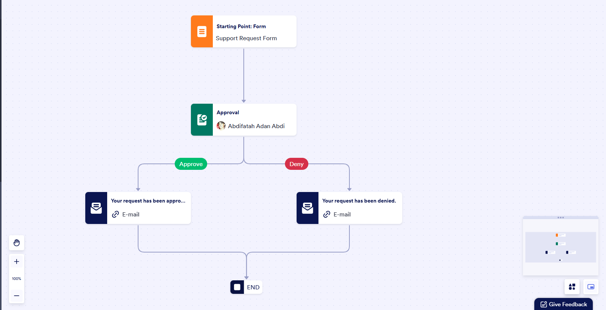

# 📅 AI-Powered Appointment Scheduler  

An AI Workflow Appointment Scheduler that automates meeting requests, approvals, and calendar bookings.  
The system ensures smooth scheduling by handling approvals and automatically updating Google Calendar.  

 <!-- Replace with your uploaded screenshot -->

---

## 🚀 Features  
- 📝 Request Form – Users can submit appointment requests online  
- ✅ Approval Workflow – Admin (or staff) approves or denies requests  
- 📩 Automated Notifications – Email confirmations for approvals/denials  
- 📅 Google Calendar Integration – Approved appointments are automatically scheduled  
- ⚡ End-to-End Automation** – Reduces manual scheduling and errors  

---

## 🛠️ Tech Stack  
- Platform: Jotform Approval Workflow  
- Calendar: Google Calendar API  
- Notifications: Automated Email Integration  
- AI Logic: Workflow rules for auto-approvals and scheduling  

---

## 📸 Demo  
Workflow Example: 

1. User submits a support/appointment request form.  
2. Request goes to admin for Approval or Denial.  
3. - If Approved → Appointment is scheduled in Google Calendar + Email confirmation sent.  
   - If Denied → User receives an email with denial info.  


---

## 📂 Project Structure  
```bash
.
├── demo.png        # Screenshot of workflow
├── README.md       # Documentation
└── (Other files if applicable)
